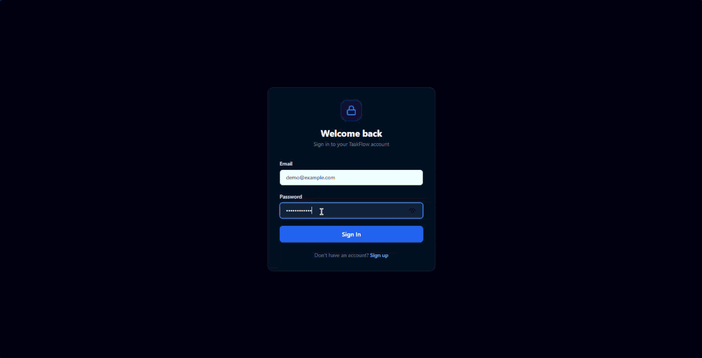
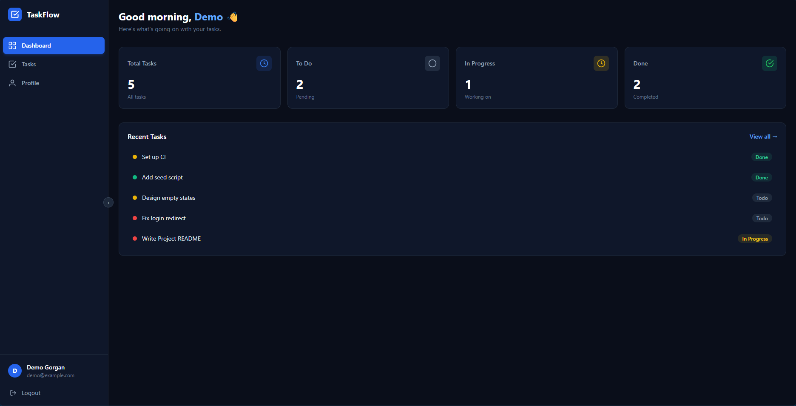
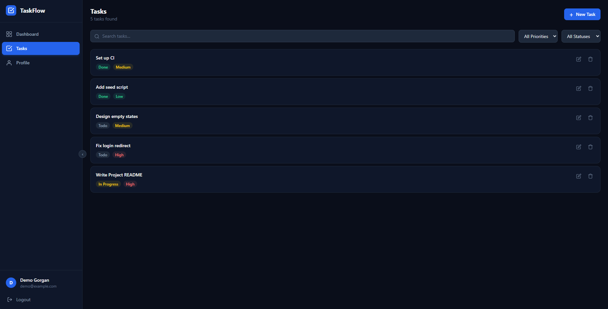
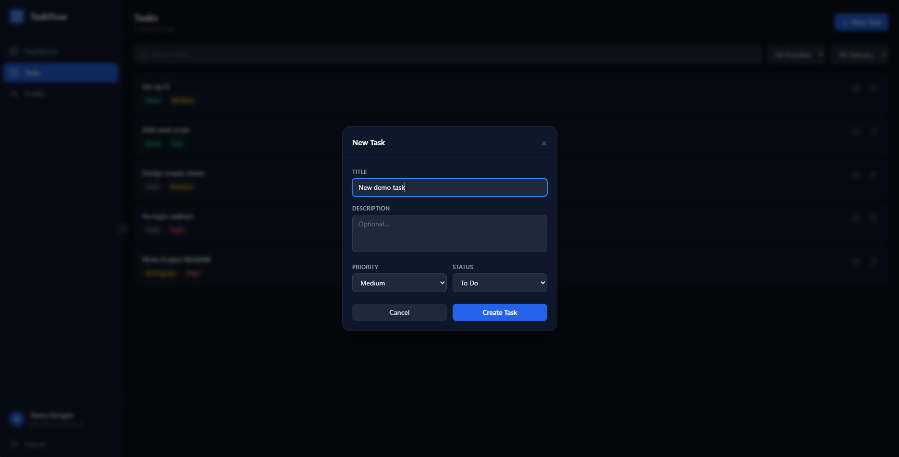
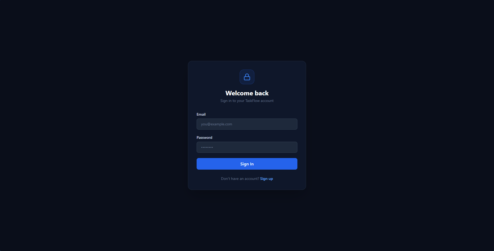
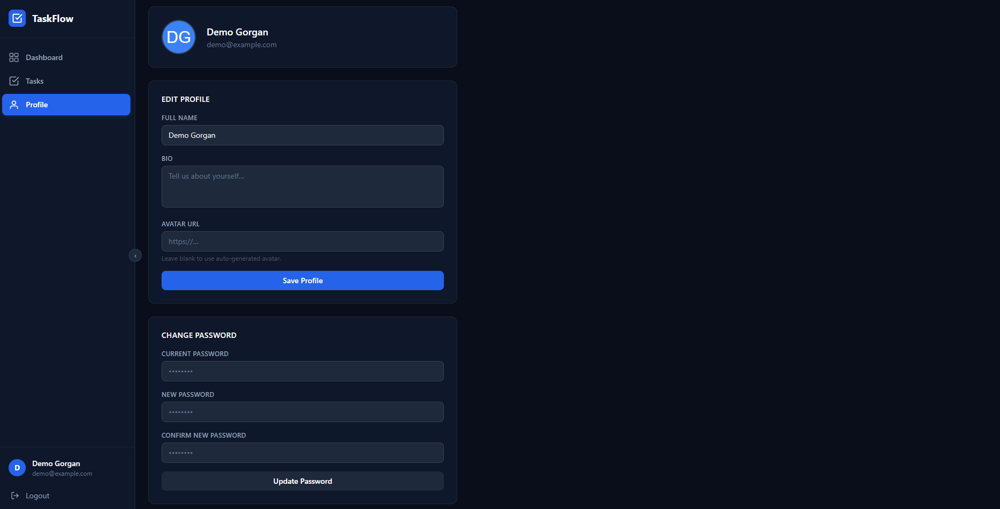

# TaskFlow

**A clean, beginner-friendly full-stack task manager built with MongoDB, Express, React and Node, made for learning and first open-source contributions.**

[](LICENSE)
[](CONTRIBUTING.md)
[](https://github.com/KEX-03/taskflow/labels/good%20first%20issue)
[](https://taskflow-plum-one.vercel.app)



## Live demo

**👉 [taskflow-plum-one.vercel.app](https://taskflow-plum-one.vercel.app)**: sign up with any email (it doesn't need to be real) and try it out.

> ⏳ **The first load can take up to a minute.** The API runs on a free hosting plan that goes to sleep when nobody is using it, and waking up takes a moment. After that it's fast.

## Features

- **Sign up and log in** with secure password hashing and JWT (token-based) authentication
- **Dashboard** with task counts by status and your most recent tasks
- **Tasks**: create, edit and delete, with search and filters by priority and status
- **Profile**: update your name, bio and avatar, and change your password
- **Protected pages**: logged-out visitors are sent to the login page
- **Each user only sees their own tasks**, enforced by the API
- **Clean, readable code** split into small files, with a [contributing guide](CONTRIBUTING.md) that explains where everything lives

<details>
<summary><b>More screenshots</b></summary>

**Dashboard**



| Tasks | New task |
|-------|----------|
|  |  |

| Login | Profile |
|-------|---------|
|  |  |

</details>

## Tech stack

| Part | Technology |
|------|------------|
| Frontend | [React 18](https://react.dev), [React Router 7](https://reactrouter.com), [Tailwind CSS 4](https://tailwindcss.com), [Axios](https://axios-http.com), built with [Vite](https://vite.dev) |
| Backend | [Node.js](https://nodejs.org), [Express 4](https://expressjs.com) |
| Database | [MongoDB](https://www.mongodb.com) with [Mongoose](https://mongoosejs.com) |
| Auth | JSON Web Tokens ([jsonwebtoken](https://github.com/auth0/node-jsonwebtoken)), password hashing with [bcryptjs](https://github.com/dcodeIO/bcrypt.js) |
| Hosting (demo) | [Vercel](https://vercel.com) (frontend), [Render](https://render.com) (API), [MongoDB Atlas](https://www.mongodb.com/atlas) (database) |

## Quick start

### 1. What you need

- [Node.js](https://nodejs.org) **22.12 or newer** (24 recommended). Check with `node --version`.
- [Git](https://git-scm.com)
- **MongoDB**, either one of:
  - **Local:** install [MongoDB Community Server](https://www.mongodb.com/try/download/community). Nothing else to configure.
  - **Cloud (free):** create a cluster on [MongoDB Atlas](https://www.mongodb.com/atlas) and copy its connection string (see [step 1 of the deployment guide](docs/DEPLOYMENT.md#1-database-mongodb-atlas)).

### 2. Clone and install

```bash
git clone https://github.com/KEX-03/taskflow.git
cd taskflow
npm run install:all
```

Planning to contribute? [Fork the repository](https://github.com/KEX-03/taskflow/fork) first and clone your fork instead (see [CONTRIBUTING.md](CONTRIBUTING.md#fork-and-clone)).

### 3. Create your settings files

```bash
# macOS / Linux / Git Bash
cp server/.env.example server/.env
cp client/.env.example client/.env
```

```powershell
# Windows PowerShell
Copy-Item server/.env.example server/.env
Copy-Item client/.env.example client/.env
```

The defaults work with a **local MongoDB**. Using **Atlas**? Open `server/.env` and replace `MONGO_URI` with your connection string. Every setting is explained in the `.env.example` files.

### 4. Run it

```bash
npm run dev
```

This starts both parts together:

- **API** at http://localhost:5000 (health check: http://localhost:5000/api/v1/health)
- **App** at **http://localhost:3000**: open it and sign up for an account

| Command (from the repository root) | What it does |
|------------------------------------|--------------|
| `npm run install:all` | Install dependencies for the root, server and client |
| `npm run dev` | Start the API and the app together |
| `npm run dev:server` | Start only the API |
| `npm run dev:client` | Start only the app |
| `npm run build` | Build the app for production (into `client/dist/`) |

**Something not working?** The server prints a `❌` message explaining what's wrong, for example a missing setting or MongoDB not running.

## Project structure

```
taskflow/
├── server/                  Express REST API
│   ├── src/
│   │   ├── app.js           Entry point: middleware, routes and startup
│   │   ├── config/          MongoDB connection
│   │   ├── models/          Mongoose schemas (User, Task)
│   │   ├── controllers/     Request handlers: the logic for each endpoint
│   │   ├── routes/          Maps URLs to controllers
│   │   ├── middleware/      `protect`: checks the login token
│   │   └── utils/           Helpers for tokens, errors and query parsing
│   └── .env.example         Server settings, explained
├── client/                  React app (Vite)
│   ├── src/
│   │   ├── App.jsx          All page routes
│   │   ├── pages/           One file per page (Login, Dashboard, Tasks, ...)
│   │   ├── components/      Shared UI (Sidebar, Toast, Spinner, ...)
│   │   ├── context/         AuthContext: who is logged in
│   │   └── utils/           Axios API client and form validation
│   ├── vercel.json          Lets Vercel serve every page route
│   └── .env.example         Client settings, explained
├── docs/                    Architecture overview, deployment guide and images
├── postman_collection.json  Ready-made API requests for Postman
└── package.json             Helper scripts to run everything from the root
```

**New to the code?** [How TaskFlow works](docs/ARCHITECTURE.md) is a five-minute tour of the request flow, login, data model and React app.

## API overview

All endpoints start with `/api/v1`. Endpoints marked 🔒 need a login token in the header: `Authorization: Bearer <token>`. You get a token from signup or login.

| Method | Endpoint | | Description |
|--------|----------|---|-------------|
| `POST` | `/auth/signup` | | Create an account, returns a token |
| `POST` | `/auth/login` | | Log in, returns a token |
| `POST` | `/auth/logout` | 🔒 | Log out (the app deletes its token) |
| `GET` | `/me` | 🔒 | Get your profile |
| `PUT` | `/me` | 🔒 | Update your profile or password |
| `GET` | `/tasks` | 🔒 | List your tasks. Optional: `?search=`, `?status=`, `?priority=`, `?page=`, `?limit=` |
| `POST` | `/tasks` | 🔒 | Create a task |
| `GET` | `/tasks/:id` | 🔒 | Get one task |
| `PUT` | `/tasks/:id` | 🔒 | Update a task |
| `DELETE` | `/tasks/:id` | 🔒 | Delete a task |
| `GET` | `/health` | | Check that the API is running |

**Try it in Postman:** import [`postman_collection.json`](postman_collection.json). After you run *Signup* or *Login*, the token is saved and used by every other request automatically.

## Deployment

TaskFlow runs on free plans of MongoDB Atlas, Render and Vercel. The [deployment guide](docs/DEPLOYMENT.md) walks through every setting and environment variable.

## Contributing

Contributions of all sizes are welcome, especially from **first-time contributors**! 🎉

1. Pick an issue labelled [**good first issue**](https://github.com/KEX-03/taskflow/labels/good%20first%20issue) and comment that you'd like to work on it.
2. Follow the [contributing guide](CONTRIBUTING.md): it covers setup, branches, commit messages, testing and opening a pull request, step by step.
3. Questions? Ask in [Discussions](https://github.com/KEX-03/taskflow/discussions).

Please follow our [Code of Conduct](CODE_OF_CONDUCT.md). Found a security problem? See [SECURITY.md](SECURITY.md). Changes are listed in the [changelog](CHANGELOG.md).

## License

[MIT](LICENSE) © 2026 KEX-03
