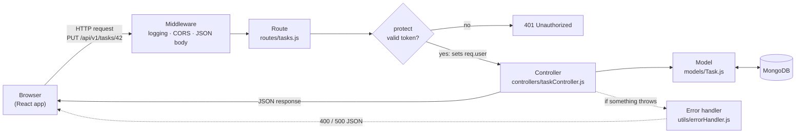

# How TaskFlow works

A five-minute tour of the code: how a request travels through the server, how login works, how data is stored, and how the React app is organised. For step-by-step "add an endpoint" and "add a page" examples, see [Where things live](../CONTRIBUTING.md#6-where-things-live) in the contributing guide.

## The big picture

TaskFlow has three parts that talk over the network:

- **Client** (`client/`): a React app running in the browser. It shows the pages and sends requests to the API.
- **Server** (`server/`): an Express API. It checks who you are, applies the rules, and reads and writes the database.
- **Database**: MongoDB, which stores users and tasks.

The client and server only talk using **JSON over HTTP**, at URLs starting with `/api/v1`.

## Request flow

Every request to the server passes through the same steps, in the order they're set up in [`server/src/app.js`](../server/src/app.js):



1. **Middleware** runs first for every request: `morgan` logs it, `cors` tells the browser which frontend origins may read the response (`FRONTEND_ORIGIN`), and `express.json()` turns the JSON body into `req.body`.
2. **Route** ([`routes/`](../server/src/routes)): matches the method and URL (like `PUT /tasks/:id`) and decides which functions run.
3. **`protect` middleware** ([`middleware/auth.js`](../server/src/middleware/auth.js)): on protected routes, checks the login token. If it's missing or invalid, the request stops here with **401**. If it's valid, it loads the user into `req.user`.
4. **Controller** ([`controllers/`](../server/src/controllers)): the actual logic. It validates input, talks to the model, and sends a JSON response like `{ "success": true, "task": { ... } }`.
5. **Model** ([`models/`](../server/src/models)): a Mongoose schema that defines the shape and rules of the data and reads and writes MongoDB.

**When something goes wrong:** every controller is wrapped in `asyncHandler`, which passes any error to the **error handler**. It turns Mongoose validation errors and duplicate emails into **400** responses, and anything else into a **500**. URLs that match no route get a **404** (`Route not found`).

## Authentication flow

TaskFlow uses **JSON Web Tokens (JWT)**: after you log in, the server gives the client a signed token, and the client sends it with every request to prove who it is. The server doesn't keep a list of logged-in users.

1. **Sign up or log in.** The client sends the email and password to `POST /auth/signup` or `POST /auth/login`.
   - On signup, the `User` model **hashes the password** with bcrypt before saving it, so the real password is never stored.
   - On login, the server compares the password with the stored hash.
2. **The server issues a token.** [`utils/token.js`](../server/src/utils/token.js) signs a JWT containing the user's id with `JWT_SECRET`. It expires after `JWT_EXPIRES_IN` (default 7 days). The response contains the `token` and the `user`.
3. **The client stores it.** [`AuthContext`](../client/src/context/AuthContext.jsx) saves the token in the browser's `localStorage` and keeps the user in React state.
4. **The Axios interceptor attaches it.** Before every request, [`utils/api.js`](../client/src/utils/api.js) adds the header `Authorization: Bearer <token>`.
5. **The server checks it.** `protect` verifies the token's signature and expiry, then loads the user from the database.
6. **The 401 handler clears it.** If any response is **401** (token expired, invalid, or the user was deleted), the Axios response interceptor removes the token from `localStorage`. The next time the app loads, you're sent to the login page.
7. **Returning visits.** When the app starts, `AuthContext` calls `GET /me` with the saved token. If it works, you're logged in; if not, the token is cleared.
8. **Logout** simply deletes the token on the client. Because the server keeps no session, there's nothing to delete there; `POST /auth/logout` exists only so the client has a clean call to make.

## Data model

Two collections, defined in [`server/src/models/`](../server/src/models):

| **User** | | **Task** | |
|---|---|---|---|
| `name` | string, 2+ characters | `title` | string, required, up to 200 characters |
| `email` | string, unique, stored lowercase | `description` | string, up to 1000 characters |
| `password` | bcrypt hash, **never sent to the client** | `priority` | `low`, `medium` (default) or `high` |
| `bio` | string, up to 300 characters | `status` | `todo` (default), `in-progress` or `done` |
| `avatar` | image URL (optional) | `owner` | id of the **User** who created it |
| `createdAt`, `updatedAt` | added automatically | `createdAt`, `updatedAt` | added automatically |

**Ownership:** each task belongs to exactly one user through `owner`. Every task query in the controller includes `owner: req.user._id`, so **users can only see and change their own tasks**. Asking for someone else's task returns **404**, the same as a task that doesn't exist, so nobody can find out which task ids are in use. An index on `owner` + `createdAt` keeps "my newest tasks" queries fast.

The password is removed every time a user is turned into JSON (`toJSON` in `User.js`), so it can't leak into a response by accident.

## Client structure

```
client/src/
├── index.jsx          Starts React and renders <App />
├── App.jsx            Providers + all routes
├── pages/             Login, Signup, Dashboard, Tasks, Profile
├── context/           AuthContext: user, token, login/signup/logout
├── components/
│   ├── Layout/        Sidebar, ProtectedRoute
│   └── Shared/        Toast (pop-up messages), Spinner
└── utils/
    ├── api.js         Axios instance + token and 401 interceptors
    └── validation.js  Form checks for signup and login
```

- **`App.jsx`** wraps everything in three providers: `BrowserRouter` (URLs), `AuthProvider` (who is logged in) and `ToastProvider` (messages). Then it lists the routes:
  - `/login` and `/signup` use `AuthRoute`, which sends already logged-in users to the dashboard.
  - `/dashboard`, `/tasks` and `/profile` use `ProtectedRoute`, which sends logged-out users to `/login`, and `DashLayout`, which adds the sidebar.
  - Any other URL redirects to `/login`.
- **Pages** own their data: each one calls the API through `utils/api.js` when it loads and keeps the results in its own state (`useState`). There's no global data store besides the logged-in user.
- **Context** shares the logged-in user with every component through the `useAuth()` hook, and `useToast()` shows success and error messages.
- **Validation** happens twice: `utils/validation.js` gives instant feedback in forms, but **the server is the source of truth** and checks everything again, because anyone can call the API directly.
- **Styling** uses Tailwind CSS utility classes directly in the JSX. Theme colors and animations are defined in [`src/index.css`](../client/src/index.css).

In production, the client is a static site on Vercel, and [`client/vercel.json`](../client/vercel.json) sends every URL to `index.html` so React Router can show the right page. See the [deployment guide](DEPLOYMENT.md) for how the three parts are hosted.
